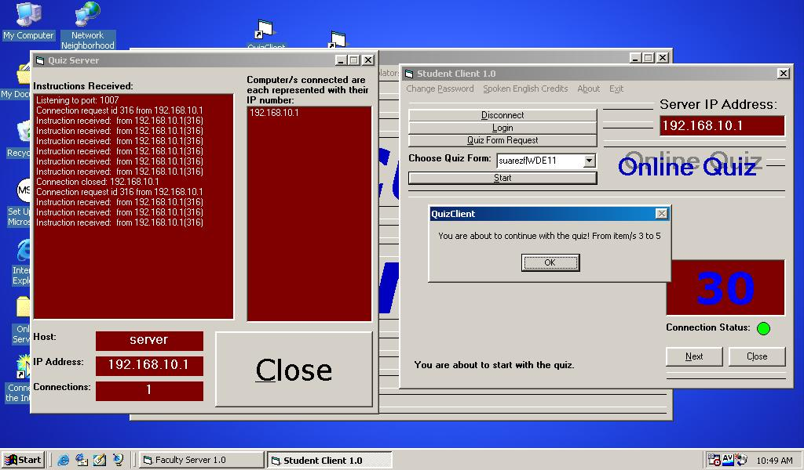



## Online Quiz System

### Description

This in an Online Quiz System. The instructor can let the students take the quizzes online. There are two programs: Faculty Server and Student Client programs. The FAculty Server program needs to be run in a server unit. The Student Client program, which is stored in QUIZCLIENT subfolder needs to be run in several client computers (like 30 computers). It uses Winsock and MS Access 2000. Connect the database thru ODBC. String manipulation is "heavy" which includes chracter sentinels to break the data being sent and received. If you have questions just email me. Thanks.
 
### More Info
 
Winsock, MS Access 2000, and ODBC connection. Password is stored in the database - not encrypted. Password is "touch" to open the database.

             |
---                |---
**Submitted On**   |2005-01-12 17:46:44
**By**             |[Francis Allan D\. Suarez](https://github.com/Planet-Source-Code/PSCIndex/blob/master/ByAuthor/francis-allan-d-suarez.md)
**Level**          |Advanced
**User Rating**    |4.7 (14 globes from 3 users)
**Compatibility**  |VB 6\.0
**Category**       |[Databases/ Data Access/ DAO/ ADO](https://github.com/Planet-Source-Code/PSCIndex/blob/master/ByCategory/databases-data-access-dao-ado__1-6.md)
**World**          |[Visual Basic](https://github.com/Planet-Source-Code/PSCIndex/blob/master/ByWorld/visual-basic.md)
**Archive File**   |[Online\_Qui189885692005\.zip](https://github.com/Planet-Source-Code/francis-allan-d-suarez-online-quiz-system__1-61002/archive/master.zip)

